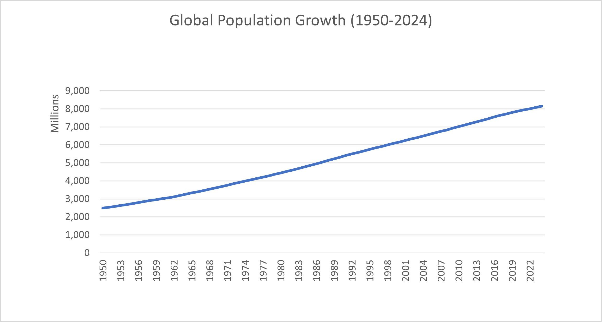
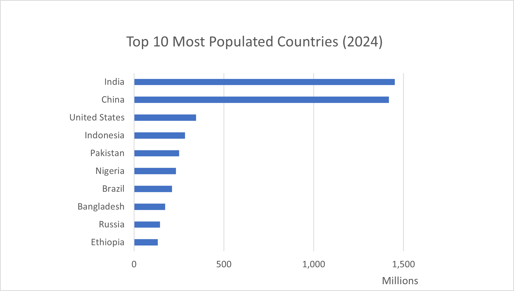
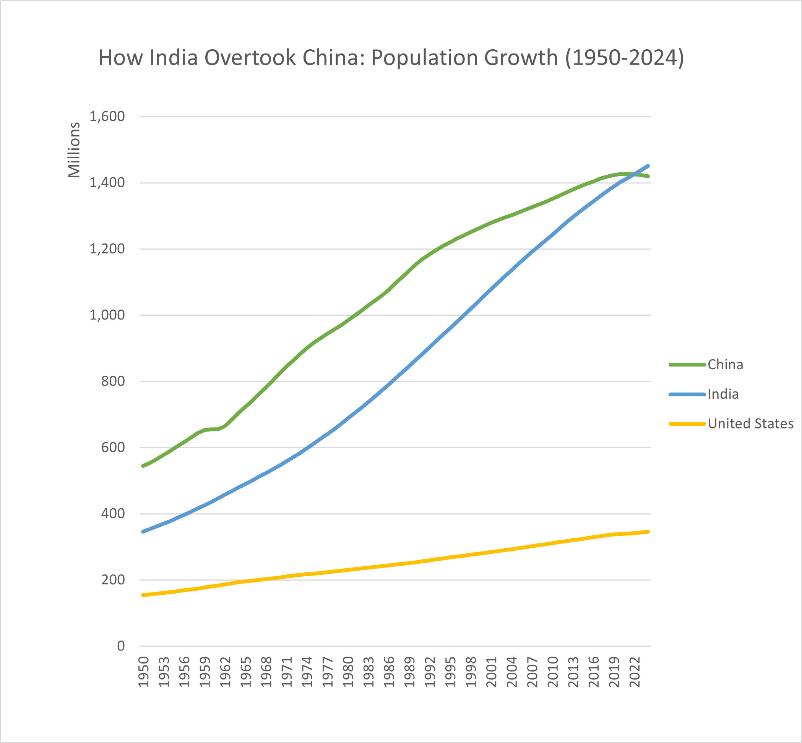

# global-population-analysis
Excel-based data analysis project exploring global population trends (1950–2024). Includes data cleaning, pivot tables, and visualizations highlighting population growth, top countries, and India surpassing China.
# 🌍 Global Population Analysis (1950–2024)

## 📌 Objective

To analyze global population trends over time and compare growth patterns across major countries using Excel.

---

## 🛠️ Tools Used

* Microsoft Excel

  * Pivot Tables
  * Data Cleaning
  * Data Visualization

---

## 📊 Dataset

* Global population data by country (1950–2024)

---

## 🔍 Key Insights

* Global population has grown steadily from ~2.5 billion (1950) to over 8 billion (2024), showing a consistent upward trend.

* India has **surpassed China** to become the most populous country in the world, marking a major demographic shift.

* China’s population growth has **slowed significantly in recent years**, while India continues to grow at a faster rate.

* The United States shows **stable and gradual growth**, unlike the sharper increases seen in developing countries.

* A small number of countries contribute a **disproportionately large share** of the global population.

---

## 📈 Visualizations

---

## 🎯 Conclusion

## 🎯 Conclusion

This analysis reveals a clear and significant shift in global population dynamics over the past seven decades.

While global population has grown steadily from ~2.5 billion in 1950 to over 8 billion in 2024, the distribution of that growth has been uneven.

India has now surpassed China to become the world’s most populous country, marking a major demographic transition. At the same time, China’s population growth has slowed considerably, indicating a shift toward stabilization.

In contrast, the United States has experienced consistent but moderate growth, reflecting a more stable demographic pattern.

Overall, a small number of countries continue to account for a large share of the global population, highlighting the importance of regional trends in shaping the future of the world’s population.

These trends have important implications for economic growth, resource distribution, and future policy planning worldwide.

## 📎 Repository Contents

* Excel file with cleaned data and dashboards
* Visualizations built using Pivot Tables and charts

---
